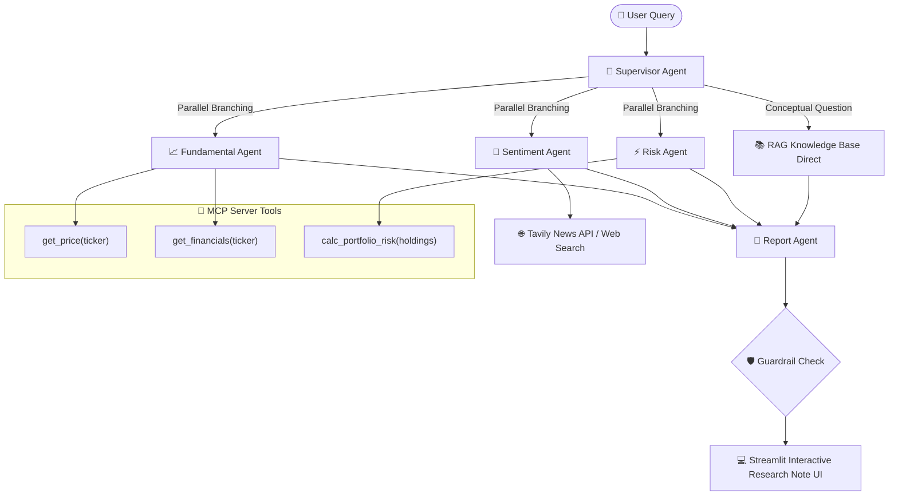

# 📊 Stock Research & Portfolio Assistant

**Domain:** Finance  
**Framework:** LangGraph + Model Context Protocol (MCP) + RAG Knowledge Base + Streamlit UI

An intelligent, multi-agent financial research assistant that analyzes individual stocks and custom investment portfolios across fundamental financial metrics, news sentiment, and risk parameters. Designed specifically for retail investors, finance students, and investment club members to promote objective, educational research.

---

## 🏗️ System Architecture & Workflow



---

## 🌟 Key Features & Highlights

### 🤖 Multi-Agent Orchestration (LangGraph):
* **Supervisor Agent**: Parses user queries, detects intent (single stock, portfolio risk, sentiment, or conceptual RAG), extracts ticker symbols and portfolio weight percentages.
* **Fundamental Agent**: Leverages MCP server tools to pull key financial metrics (P/E ratio, P/B ratio, D/E ratio, ROE, revenue growth) and interprets them in educational context.
* **Sentiment Agent**: Gathers news announcements via Tavily Search / market feeds and classifies overall news sentiment with verifiable evidence snippets.
* **Risk Agent**: Computes portfolio weighted Beta, annualized volatility, Herfindahl-Hirschman Index (HHI) concentration risk, and risk ratings.
* **Report Agent**: Synthesizes all parallel branch findings into a balanced, educational research note with required guardrail disclaimers.

### 🔌 Model Context Protocol (MCP) Tools:
* `get_price`: Retrieves current market price, 52-week high/low, and 60-day price history.
* `get_financials`: Returns fundamental valuation ratios, margin trends, debt leverage, and capital efficiency.
* `calc_portfolio_risk`: Calculates weighted beta, estimated annualized volatility, concentration index, and risk rating for custom holding weights.

### 📖 RAG Knowledge Base:
Built-in educational repository based on SEBI Investor Education materials, BSE/NSE financial literacy guides, and financial term glossaries. Answers conceptual questions directly (e.g. *"What does a P/E ratio of 35 mean?"*).

### 🛡️ Strict Regulatory Guardrails:
* **Never** provides "buy", "sell", or price target recommendations.
* States the exact reference date of all historical data used.
* Appends mandatory SEBI-compliant educational disclaimers to every research note.

### 🖥️ Simple & Neat Interactive Web UI:
* Clean, light-mode interface powered by Streamlit.
* Sidebar configuration for API Keys (Gemini & Tavily).
* Interactive markdown research reports with one-click `.md` download.

---

## 📁 Repository Structure
```text
.
├── agents/
│   ├── __init__.py
│   ├── supervisor.py       # Intent classification & ticker extraction
│   ├── fundamental.py      # MCP financial statement analysis node
│   ├── sentiment.py        # Tavily news & sentiment classification node
│   ├── risk.py             # Portfolio risk calculation node
│   └── report.py           # Report compilation & guardrail verification node
├── data/
│   └── financial_glossary.json  # RAG knowledge base document store
├── mcp_server/
│   ├── __init__.py
│   ├── tools.py            # MCP tools (get_price, get_financials, calc_portfolio_risk)
│   └── server.py           # FastMCP / standard MCP server entrypoint
├── rag/
│   ├── __init__.py
│   └── knowledge_base.py   # RAG vector / keyword retrieval engine
├── .env.example            # Environment variables template
├── .gitignore              # Git ignore rules
├── README.md               # Documentation & setup guide
├── app.py                  # Streamlit web application frontend
├── config.py               # Configuration & default models (gemini-flash-lite)
└── requirements.txt        # Python package dependencies
```

---

## 🚀 Quickstart & Setup Guide

### 1. Prerequisites
* Python 3.10+ (Tested on Python 3.13)
* Git

### 2. Clone & Install Dependencies
```bash
# Clone repository
git clone <repository_url>
cd Project

# Install dependencies
pip install -r requirements.txt
```

### 3. Environment Configuration (Optional)
Copy `.env.example` to `.env` and provide your API keys if real-time web search or LLM API keys are desired:

```bash
cp .env.example .env
```
*(Note: The Streamlit app UI now allows you to paste the Gemini and Tavily API keys directly in the sidebar for ease of use.)*

### 4. Running the Application
Launch Streamlit Web UI:
```bash
streamlit run app.py
```
Open your browser at `http://localhost:8501` to access the interactive dashboard.

Run FastMCP Server (Standalone MCP Protocol Mode):
```bash
python mcp_server/server.py
```

---

## 🎯 Sample User Queries Supported

| Query Type | Sample Input | Target Agents Executed |
| :--- | :--- | :--- |
| **Single Stock Research** | *"Give me a research summary of Infosys."* | Supervisor ➔ Fundamental + Sentiment + Risk ➔ Report |
| **Portfolio Risk** | *"My portfolio is 40% TCS, 30% HDFC Bank and 30% Reliance. How risky is it?"* | Supervisor ➔ Risk + Fundamental + Sentiment ➔ Report |
| **Conceptual RAG** | *"What does a P/E ratio of 35 mean for this company?"* | Supervisor ➔ RAG Knowledge Base ➔ Report |
| **News Sentiment** | *"What is the recent news sentiment around Tata Motors?"* | Supervisor ➔ Sentiment + Fundamental ➔ Report |

---

## 🛡️ Guardrails and Regulatory Compliance
This assistant enforces strict educational parameters:
1. **No Actionable Advice:** The output is programmatically sanitized to avoid buy, sell, or target price instructions.
2. **Data Transparency:** Every generated report explicitly displays the data reference timestamp.
3. **Mandatory Disclaimer:** 
   > *Disclaimer: This research note is strictly for educational and informational purposes only and does not constitute financial advice, investment recommendations, or buy/sell instructions.*

---

## 📝 License
Distributed under the MIT License. Educational research tool project.
