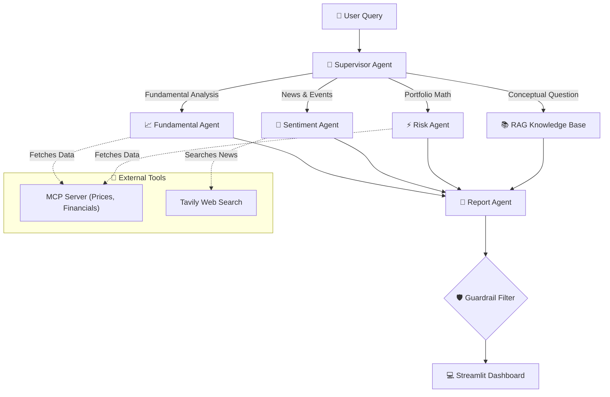
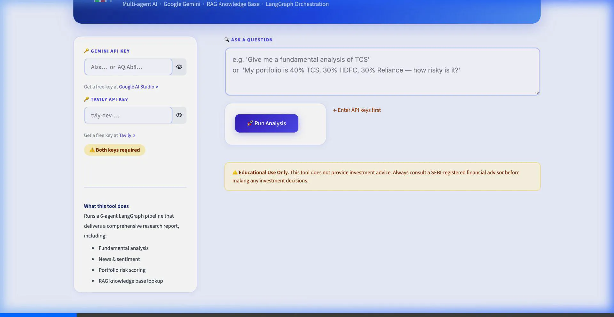

# 📊 Stock Research & Portfolio Assistant

**An AgenticAI Capstone Project**  
*Built with LangGraph, Google Gemini, Model Context Protocol (MCP), and Streamlit*

This project is a multi-agent AI financial assistant designed to help retail investors and finance students analyze stocks and portfolios. Instead of just giving a single LLM a prompt, this application uses a **LangGraph-orchestrated team of 6 specialized AI agents**. They work together to gather real-time data, fetch news sentiment, calculate portfolio risk, and retrieve educational concepts—ultimately synthesizing everything into a clean, easy-to-read, and strictly educational research report.

---

## 🌟 What I Have Built

I developed a full-stack AI pipeline that solves complex financial queries through specialized agent delegation. Here is what the system does under the hood:

1. **Intelligent Routing (Supervisor):** When you type a query, the system doesn't just guess what you want. A Supervisor Agent analyzes your intent, extracts stock tickers or portfolio weights, and routes the task to the exact agents needed.
2. **Real-time Financial Data (MCP):** Using the Model Context Protocol, the Fundamental Agent pulls live market prices, historical data, and financial ratios dynamically.
3. **Live Web & News Sentiment:** The Sentiment Agent uses the Tavily Search API to scan the internet for the most recent news about a stock and summarizes the market's current mood.
4. **Custom Portfolio Risk Calculation:** If you provide a portfolio (e.g., 40% TCS, 60% Reliance), the Risk Agent calculates actual risk metrics like Beta and annualized volatility based on your specific weights.
5. **RAG Knowledge Base:** I implemented a local Vector Store using FAISS. If you ask a conceptual question (e.g., "What is a P/E ratio?"), the RAG Agent answers using verified educational documents rather than hallucinating.
6. **Safe & Compliant Reporting:** The final Report Agent gathers all the data, formats it beautifully in Markdown, and applies strict guardrails (using Regex) to prevent the AI from giving illegal "Buy" or "Sell" advice.

---

## 🏗️ System Architecture Workflow



---

## 📁 Repository Structure

```text
.
├── agents/                 # The 6 LangGraph specialized agents
│   ├── supervisor.py       
│   ├── fundamental_agent.py      
│   ├── sentiment_agent.py        
│   ├── risk_agent.py             
│   └── report_agent.py           
├── mcp_server/             # Model Context Protocol integration
│   ├── stock_mcp_server.py # Provides get_price, get_financials, etc.
├── rag/                    # Retrieval-Augmented Generation
│   ├── documents/          # Educational texts and glossaries
│   └── vectorstore/        # FAISS index for fast retrieval
├── app.py                  # The Streamlit web interface
├── config.py               # Global settings and LLM configuration
├── graph/                  # LangGraph state and orchestrator
└── requirements.txt        # Python dependencies
```

---

## 🚀 How to Run the Project Locally

### 1. Install Dependencies
Make sure you have Python 3.10+ installed. Clone the repository and install the requirements:
```bash
git clone https://github.com/premjaswanthks17/AgenticAI.git
cd AgenticAI/stock_research_assistant
pip install -r requirements.txt
```

### 2. Launch the Application
Run the Streamlit interface:
```bash
streamlit run app.py
```

### 3. API Keys
Open `http://localhost:8501` in your browser. You can input your API keys directly into the secure sidebar:
* **Gemini API Key:** For the core LLM reasoning.
* **Tavily API Key:** For real-time news search.

---

## 🎯 Example Queries You Can Try

Here are detailed explanations of the types of queries this AI assistant can handle, along with what happens under the hood when you ask them.

### 1. Fundamental Research
**Example Query:** *"Give me a fundamental analysis of TCS."*
* **Concept:** This query evaluates the intrinsic value of a company. It looks at the core financial health of the business rather than just stock price movements.
* **Under the Hood:** The Supervisor detects a single stock (`TCS`). It wakes up the **Fundamental Agent**, which uses MCP tools to fetch the P/E ratio, market cap, and historical prices. The agent synthesizes this data into a human-readable summary of the company's valuation.

### 2. News Sentiment Analysis
**Example Query:** *"What is the recent news sentiment around Tata Motors?"*
* **Concept:** Market prices are heavily driven by public perception and current events. This query analyzes the "mood" of the market regarding a specific stock.
* **Under the Hood:** The Supervisor routes this to the **Sentiment Agent**. This agent triggers the Tavily Web Search API to scrape live news articles from the past 24-48 hours. It reads the headlines and categorizes the overall sentiment as Bullish, Bearish, or Neutral, providing key bullet points of recent events.

### 3. Portfolio Risk Assessment
**Example Query:** *"My portfolio is 40% TCS, 30% HDFC Bank and 30% Reliance. How risky is it?"*
* **Concept:** Modern Portfolio Theory states that risk isn't just about individual stocks, but how they move together. This query assesses the overall volatility of a custom-weighted portfolio.
* **Under the Hood:** The Supervisor extracts the tickers (`TCS, HDFC, RELIANCE`) and their exact weights (`0.4, 0.3, 0.3`). It sends these to the **Risk Agent**, which calculates the weighted Beta and annualized volatility, telling you if your portfolio is riskier or safer than the broader market.

### 4. Educational Concepts (RAG)
**Example Query:** *"What does a P/E ratio of 35 mean for a company?"*
* **Concept:** Sometimes you don't want to analyze a stock, you just want to learn a financial term. 
* **Under the Hood:** The Supervisor realizes this is a conceptual question and bypasses external APIs entirely. Instead, it wakes up the **RAG Agent**, which performs a vector similarity search across a local, curated database of financial glossaries (using FAISS). It guarantees the definition is accurate and educational.

---

## 💻 Interactive Streamlit Dashboard

The entire agentic pipeline is wrapped in a clean, interactive Streamlit UI. Simply paste your API keys in the sidebar, type your query, and the LangGraph agents will collaborate in the background to generate a comprehensive markdown report that you can instantly download.



---

## 🛡️ Educational Guardrails
This project was built with strict safety parameters for the finance domain:
* It will **never** generate "Buy", "Sell", or target price recommendations. Any such words generated by the LLM are scrubbed by the final reporting agent.
* It appends a mandatory disclaimer to every report emphasizing that the tool is for educational purposes only.
